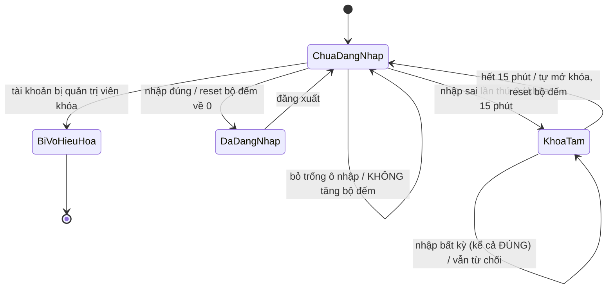

# THIẾT KẾ TEST CASE – ÁP DỤNG KỸ THUẬT ĐÃ HỌC

> Tài liệu này là **phần lý thuyết cốt lõi** của seminar: mọi test case trong `src/test/java` đều được
> suy ra từ một trong năm kỹ thuật dưới đây, chứ không viết theo cảm tính.
> SUT: xem [DeBai-SUT.md](DeBai-SUT.md).

| # | Kỹ thuật | Bài đã học | Áp dụng cho | Số test case sinh ra |
| --- | --- | --- | --- | --- |
| 1 | Phân hoạch tương đương | W7 | FR-04 Thông tin giao hàng | 12 |
| 2 | Phân tích giá trị biên | W7 | FR-02 Giỏ hàng, FR-03 ngưỡng 500k, FR-04 độ dài | 21 |
| 3 | Bảng quyết định | W5 | FR-03 Khuyến mãi | 8 |
| 4 | Sơ đồ chuyển trạng thái | W6 | FR-01 Đăng nhập | 10 |
| 5 | Kiểm thử hộp trắng (phủ lệnh/nhánh + Cyclomatic) | W7 | FR-06 `Rational` | 6 |

---

## 1. Phân hoạch tương đương (Equivalence Partitioning) – FR-04

### 1.1 Biến `fullName` (họ tên)

| Lớp | Mô tả | Hợp lệ? | Đại diện | Test case |
| --- | --- | --- | --- | --- |
| EP-N1 | Chuỗi chữ cái + khoảng trắng, dài 1–50 | ✅ | `Nguyen Van A` | TC-UNIT-060, TC-WEB-020 |
| EP-N2 | Chuỗi có chữ tiếng Việt có dấu | ✅ | `Nguyễn Thị Ánh Nguyệt` | *(bản v2 đã lược, xem `backup/v1`)* |
| EP-N3 | Rỗng / chỉ khoảng trắng | ❌ | `""`, `"   "` | TC-UNIT-063, TC-WEB-021a |
| EP-N4 | Có chữ số | ❌ | `Nguyen Van 1` | TC-UNIT-063, TC-WEB-021c |
| EP-N5 | Có ký tự đặc biệt | ❌ | `Nguyen@Van`, `Tran_Thi_B` | TC-UNIT-063 |
| EP-N6 | Dài hơn 50 ký tự | ❌ | 51 ký tự `A` | TC-UNIT-062, TC-WEB-021b |

### 1.2 Biến `phone` (số điện thoại)

| Lớp | Mô tả | Hợp lệ? | Đại diện | Test case |
| --- | --- | --- | --- | --- |
| EP-P1 | Đúng 10 chữ số, bắt đầu bằng `0` | ✅ | `0912345678` | TC-UNIT-065 |
| EP-P2 | Rỗng | ❌ | `""` | TC-UNIT-066, TC-WEB-021d |
| EP-P3 | Ít hơn 10 chữ số | ❌ | `091234567` | TC-UNIT-066, TC-WEB-021e |
| EP-P4 | Nhiều hơn 10 chữ số | ❌ | `09123456789` | TC-UNIT-066, TC-WEB-021f |
| EP-P5 | Không bắt đầu bằng `0` | ❌ | `1912345678` | TC-UNIT-066, TC-WEB-021g |
| EP-P6 | Chứa chữ cái hoặc khoảng trắng | ❌ | `091234567a`, `091 234 5678` | TC-UNIT-066 |

### 1.3 Kết luận số lượng

- `fullName`: 2 lớp hợp lệ + 4 lớp không hợp lệ → **6 test case**
- `phone`: 1 lớp hợp lệ + 5 lớp không hợp lệ → **6 test case**

> **Nguyên tắc áp dụng** (đúng như bài W7): mỗi lớp không hợp lệ được kiểm thử **riêng một test case**
> (để thông báo lỗi không che lấp nhau), còn các lớp hợp lệ được **gộp chung** trong một test case đại diện.

---

## 2. Phân tích giá trị biên (Boundary Value Analysis) – FR-02, FR-03, FR-04

### 2.1 Số lượng sản phẩm – miền hợp lệ `[1..10]`

| Giá trị | Loại biên | Kỳ vọng | Test case |
| --- | --- | --- | --- |
| 0 | min − 1 | ❌ Báo lỗi, giỏ không đổi | TC-UNIT-041 |
| 1 | min | ✅ Chấp nhận | TC-UNIT-040 |
| 5 | nominal | ✅ Chấp nhận | TC-UNIT-040 |
| 10 | max | ✅ Chấp nhận | TC-UNIT-040 |
| 11 | max + 1 | ❌ Báo lỗi | TC-UNIT-041 |

Công thức BVA cơ bản với **1 biến**: `4n + 1 = 4(1) + 1 =` **5 test case** — đúng bằng số dòng trong bảng.
Nếu dùng **robust BVA** (`6n + 1 = 7`) thì bổ sung thêm 2 giá trị ngoài miền xa: `-1` và `99` → đã có trong
`TC-UNIT-041` (nhóm test dùng `@ValueSource(ints = {-1, 0, 11, 100})`).

### 2.2 Số loại sản phẩm khác nhau – tối đa 5

| Giá trị | Loại biên | Kỳ vọng | Test case |
| --- | --- | --- | --- |
| 4 | max − 1 | ✅ | (bao hàm trong TC-UNIT-046) |
| 5 | max | ✅ | TC-UNIT-046 (kiểm 5 loại trước khi thêm loại 6) |
| 6 | max + 1 | ❌ | TC-UNIT-046 |

### 2.3 Ngưỡng khuyến mãi 500.000 (FR-03)

| Tạm tính | Loại biên | Mức giảm kỳ vọng (khách thường, không mã) | Test case |
| --- | --- | --- | --- |
| 499.999 | ngưỡng − 1 | 0% | TC-UNIT-051 |
| 500.000 | ngưỡng | 5% | TC-UNIT-051, TC-WEB-030 |
| 500.001 | ngưỡng + 1 | 5% | TC-UNIT-051 |

> Đây là biên **dễ sai nhất** trong đặc tả (`>` hay `>=`) — lý do phải kiểm thử cả ba giá trị.

### 2.4 Độ dài trường văn bản (FR-04)

| Biến | Miền | Giá trị kiểm thử | Test case |
| --- | --- | --- | --- |
| `fullName` | 1..50 | 1, 50, 51 *(v1 kiểm thêm 0, 2, 49, 60)* | TC-UNIT-061/062/063, TC-WEB-021 |
| `address` | 1..100 | 100, 101 *(v1 kiểm thêm 0, 1, 99)* | TC-UNIT-067 |
| `phone` | đúng 10 | 9, 10, 11 ký tự | TC-UNIT-066, TC-WEB-021e/f |

**Tổng số test case biên cho FR-04**: 3 biến → BVA cơ bản `4n + 1 = 13`; nhóm hiện thực **16 test case**
(nhiều hơn vì tách riêng trường hợp rỗng và trường hợp sai định dạng).

---

## 3. Bảng quyết định (Decision Table) – FR-03 Khuyến mãi

### 3.1 Xác định điều kiện và hành động

- **C1**: Khách hàng là VIP
- **C2**: Tạm tính ≥ 500.000
- **C3**: Mã giảm giá hợp lệ (`SALE10`, không phân biệt hoa thường, tự cắt khoảng trắng)
- **A1..A8**: mức giảm tương ứng

### 3.2 Bảng quyết định đầy đủ (2³ = 8 rule)

| Rule | C1 VIP | C2 ≥500k | C3 Mã hợp lệ | Hành động (mức giảm) | Test case |
| --- | --- | --- | --- | --- | --- |
| R1 | T | T | T | 25% | TC-UNIT-050[0], TC-WEB-030 |
| R2 | T | T | F | 15% | TC-UNIT-050[1] |
| R3 | T | F | T | 20% | TC-UNIT-050[2] |
| R4 | T | F | F | 10% | TC-UNIT-050[3] |
| R5 | F | T | T | 15% | TC-UNIT-050[4] |
| R6 | F | T | F | 5% | TC-UNIT-050[5] |
| R7 | F | F | T | 10% | TC-UNIT-050[6] |
| R8 | F | F | F | 0% | TC-UNIT-050[7] |

**Số test case cần thiết = số rule = 8** (không rule nào trùng hành động *và* trùng tổ hợp điều kiện nên
không rút gọn được).

### 3.3 Test case bổ sung ngoài bảng

| Mục đích | Dữ liệu | Test case |
| --- | --- | --- |
| Chuẩn hóa mã giảm giá | `sale10`, `  SALE10  `, `Sale10` | TC-UNIT-052 |
| Mã sai | `SALE11` | TC-UNIT-052[2] |
| Làm tròn xuống | 10% của 100.001 → giảm 10.000 (không phải 10.000,1) | TC-UNIT-055 |

---

## 4. Sơ đồ chuyển trạng thái (State Transition) – FR-01 Đăng nhập

### 4.1 Sơ đồ



### 4.2 Bảng chuyển trạng thái

| # | Trạng thái hiện tại | Sự kiện | Trạng thái kế tiếp | Test case (unit) | Test case (UI) |
| --- | --- | --- | --- | --- | --- |
| S1 | ChuaDangNhap | Nhập đúng | DaDangNhap | TC-UNIT-030 | TC-WEB-001, TC-PW-001 |
| S2 | ChuaDangNhap | Sai lần 1 | ChuaDangNhap (còn 2) | TC-UNIT-031 | TC-WEB-005 |
| S3 | ChuaDangNhap | Sai lần 2 | ChuaDangNhap (còn 1) | TC-UNIT-031 | TC-WEB-005 |
| S4 | ChuaDangNhap | Sai lần 3 | **KhoaTam** | TC-UNIT-032 | TC-WEB-005, TC-PW-002 |
| S5 | KhoaTam | Nhập đúng khi đang khóa | KhoaTam | TC-UNIT-033 | TC-WEB-005 |
| S6 | KhoaTam | Còn 1 giây nữa hết khóa | KhoaTam | *(v1: TC-UNIT-034, v2 đã lược)* | — |
| S7 | KhoaTam | Hết 15 phút → nhập đúng | DaDangNhap (bộ đếm = 0) | TC-UNIT-035 | — |
| S8 | ChuaDangNhap | Bỏ trống ô nhập | ChuaDangNhap (bộ đếm KHÔNG tăng) | *(v1: TC-UNIT-036)* | TC-WEB-002 (dòng CSV 2) |
| S9 | ChuaDangNhap | Tài khoản không tồn tại | ChuaDangNhap | TC-UNIT-037 | TC-WEB-002 |
| S10 | ChuaDangNhap | Tài khoản bị vô hiệu hóa | BiVoHieuHoa | *(v1: TC-UNIT-038)* | TC-WEB-002 (dòng CSV 3) |
| S11 | DaDangNhap | Đăng xuất | ChuaDangNhap | — | TC-WEB-006 |

**Độ phủ đạt được**: 11/11 phép chuyển → **0-switch coverage = 100%**.

> **Vấn đề testability và cách giải quyết** — chuyển S6/S7 phụ thuộc thời gian thực 15 phút.
> Giải pháp: `LoginService` nhận `java.time.Clock` qua constructor, test dùng `MutableClock` để
> **tua thời gian** (xem `unit-tests/.../support/MutableClock.java`). Bản web rút thời gian khóa
> xuống 60 giây vì không thể tiêm `Clock` vào trình duyệt.

---

## 5. Kiểm thử hộp trắng – FR-06 `Rational`

### 5.1 Lưu đồ và độ phức tạp của `divide()`

```java
public void divide(Rational x) throws Illegal {
    if (x.numerator == 0) {          // (1)
        throw new Illegal(...);      // (2)
    }
    numerator = numerator * x.denominator;      // (3)
    denominator = denominator * x.numerator;    // (4)
    normalize();                                // (5)
}
```

```
        (1) x.numerator == 0 ?
         /                  \
     Đúng                   Sai
      (2) throw            (3) → (4) → (5)
         \                  /
          ------ (6) exit --
```

| Đại lượng | Giá trị |
| --- | --- |
| Số cạnh E | 6 |
| Số đỉnh N | 6 |
| **V(G) = E − N + 2** | **2** |
| Số vùng khép kín | 2 |
| Số điều kiện đơn + 1 | 1 + 1 = 2 |

→ **Cần tối thiểu 2 test case** để phủ hết đường đi độc lập:

| Đường đi | Dữ liệu | Kỳ vọng | Test case |
| --- | --- | --- | --- |
| 1 → 2 → 6 | `(1/2).divide(0/5)` | Ném `Illegal`, trạng thái không đổi | TC-UNIT-017 |
| 1 → 3 → 4 → 5 → 6 | `(1/2).divide(1/3)` | `3/2` | TC-UNIT-016 |

### 5.2 `normalize()` – V(G) = 2

| Đường đi | Dữ liệu | Kỳ vọng | Test case |
| --- | --- | --- | --- |
| Mẫu số âm → đổi dấu | `1/-2` | `-1/2` | TC-UNIT-011[3] |
| Mẫu số dương → bỏ qua nhánh đổi dấu | `2/4` | `1/2` | TC-UNIT-011[0] |

### 5.3 `GCD(a, b)` – V(G) = 2 (có đệ quy)

| Đường đi | Dữ liệu | Diễn giải | Test case |
| --- | --- | --- | --- |
| Không đệ quy: `a % b == 0` | `GCD(0, 5)` khi rút gọn `0/5` | trả về ngay `5` | TC-UNIT-011[4] |
| Có đệ quy | `GCD(2, 4)` → `GCD(4, 2)` → `2` | rút gọn `2/4` → `1/2` | TC-UNIT-011[0] |

### 5.4 Kết quả đo thực tế (JaCoCo)

| Chỉ số | Yêu cầu (AC-02) | Đạt được |
| --- | --- | --- |
| Độ phủ lệnh (instruction) | ≥ 85% | **91,3%** |
| Độ phủ nhánh (branch) | ≥ 80% | **89,0%** |
| Độ phủ dòng (line) | — | **92,5%** |

Lệnh tái lập số liệu:

```bash
mvn clean verify
# mở: coverage-report/target/site/jacoco-aggregate/index.html
```

> **Nhận xét khi trình bày**: phần chưa được phủ chủ yếu là các nhánh phòng thủ (`Product` giá âm,
> `Catalog.byCode` mã sai) — cố tình giữ lại để minh họa rằng **100% coverage không phải mục tiêu**,
> mà độ phủ chỉ có ý nghĩa khi đi kèm bộ test case được thiết kế bài bản.

---

## 6. Kim tự tháp kiểm thử – vì sao cùng một quy tắc lại test ở hai tầng

| Quy tắc nghiệp vụ | Tầng unit (Java) | Tầng UI (Selenium) | Lý do |
| --- | --- | --- | --- |
| Khóa sau 3 lần sai | TC-UNIT-030..039 (10 TC, ~0,3s) | TC-WEB-005 (1 TC, ~6s) | Unit phủ mọi nhánh; UI chỉ xác nhận **luồng người dùng thật sự chạy được** |
| Bảng quyết định khuyến mãi | TC-UNIT-050 (8 rule) | TC-WEB-030 (1 rule tiêu biểu) | Chạy 8 rule qua trình duyệt là lãng phí |
| Validate thông tin giao hàng | TC-UNIT-060..070 (16 TC) | TC-WEB-021 (9 TC) | UI kiểm tra thêm việc **báo lỗi đúng vị trí trường** |

**Kết luận trình bày trong video**: đẩy phần kiểm thử tổ hợp xuống tầng unit (rẻ, nhanh, ổn định),
tầng UI chỉ giữ các kịch bản đại diện — đó là lý do bộ test có **64 unit test** nhưng chỉ **11 UI test**.
